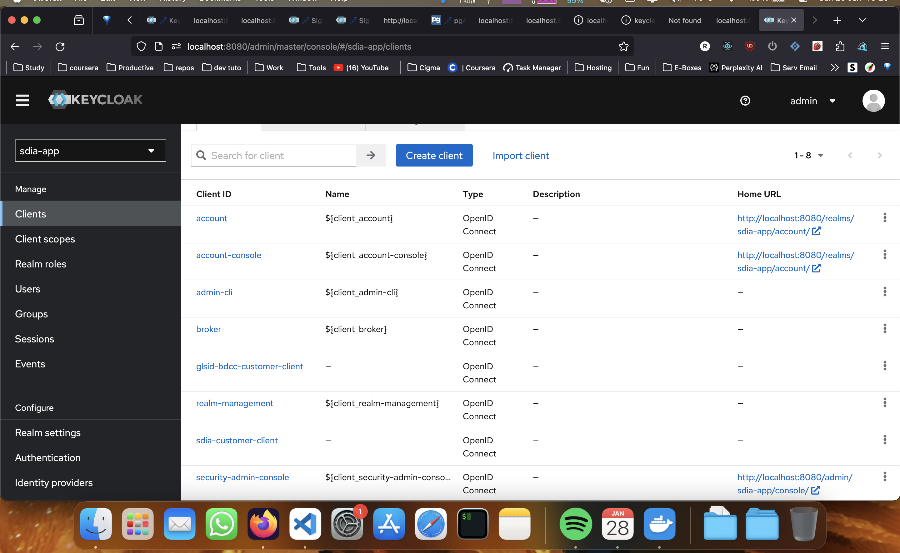
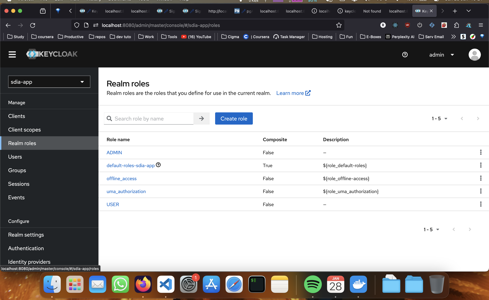
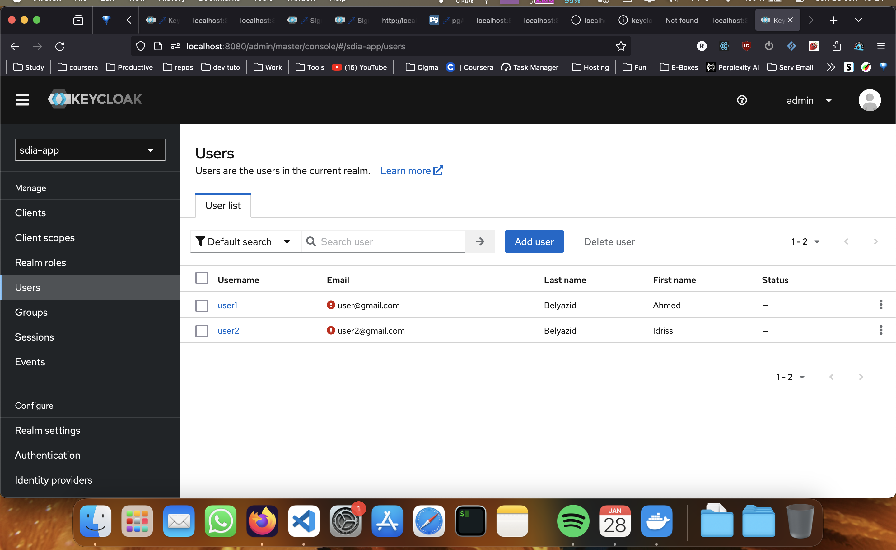
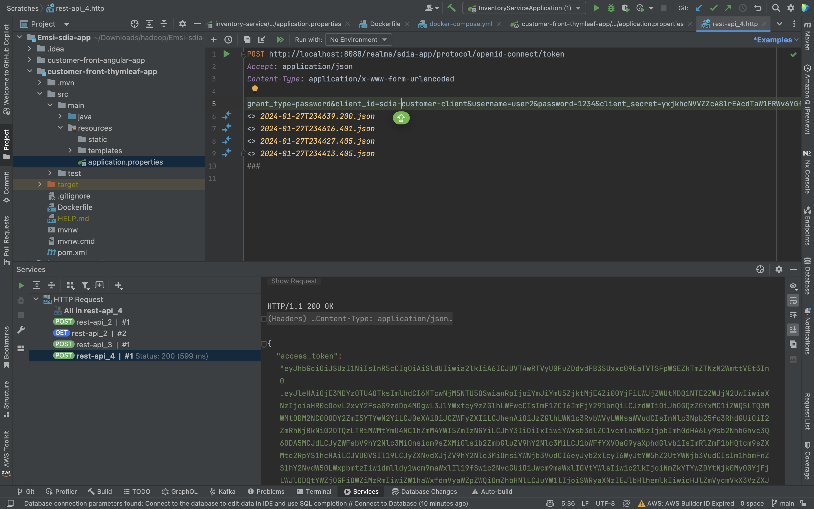
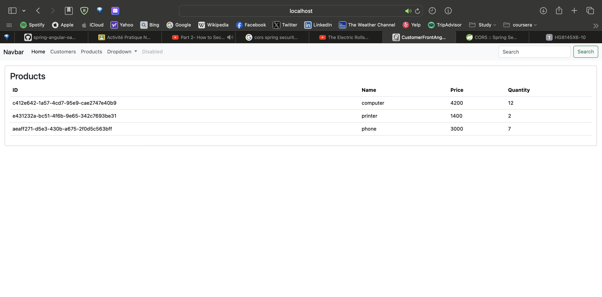
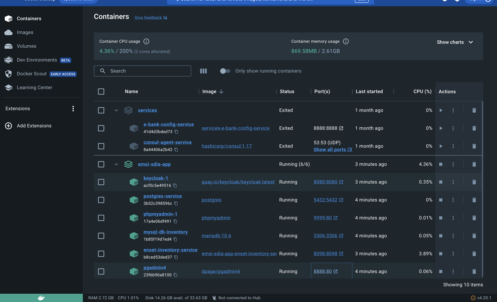
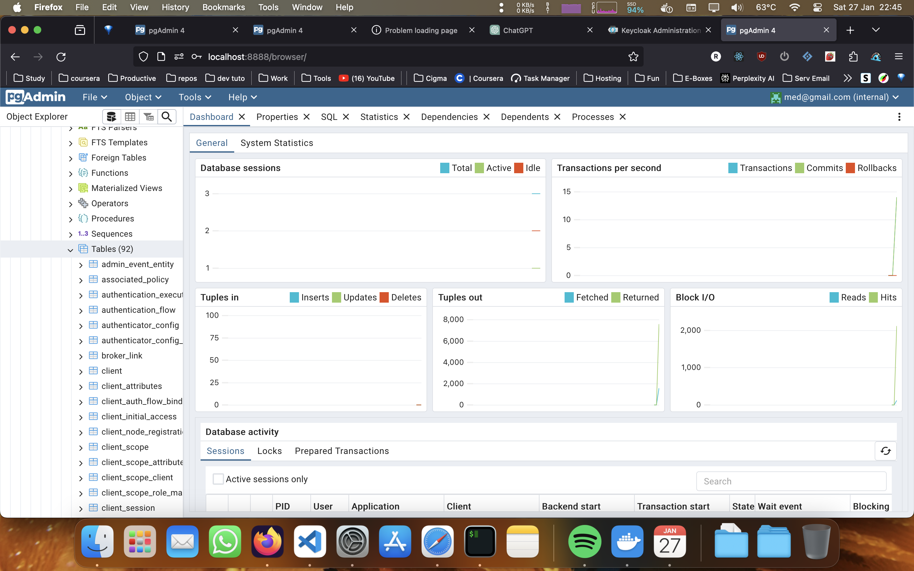
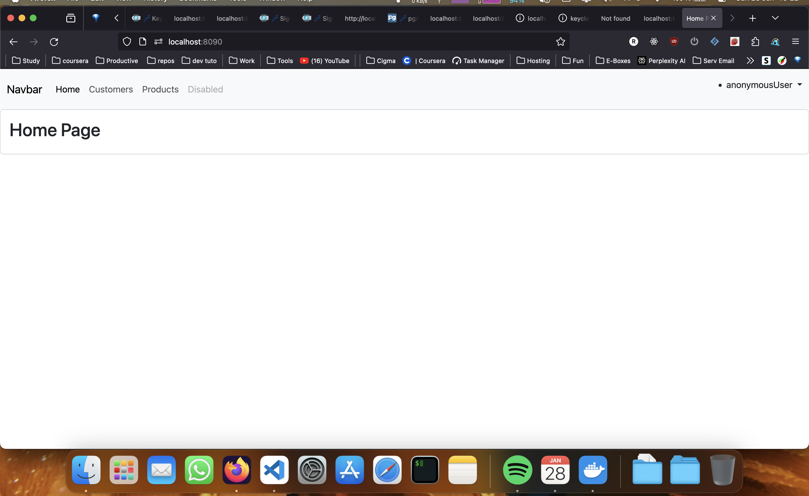
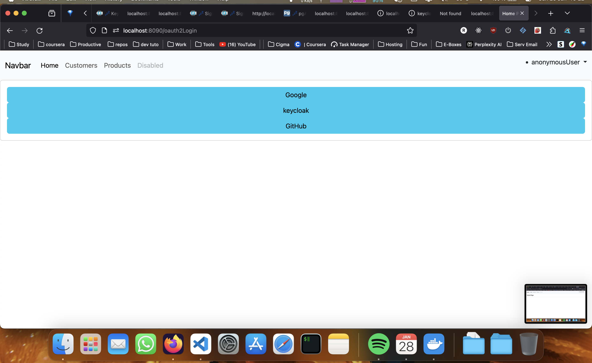

# Activité Pratique N°7 : Sécurité Oauth2, OIDC, JWT, Keycloak

**Author:** Belyazid Charafeddine

## Description

This repository contains the code and documentation for the practical assignment #7 focusing on security aspects including Oauth2, OIDC, JWT, and Keycloak. The assignment is divided into two parts.

Follow the instructions in each section to complete the assignment.

## Prerequisites

Make sure you have the following prerequisites installed:

- Keycloak 23
- Postman

## License

This project is licensed under the [MIT License](LICENSE.md).

